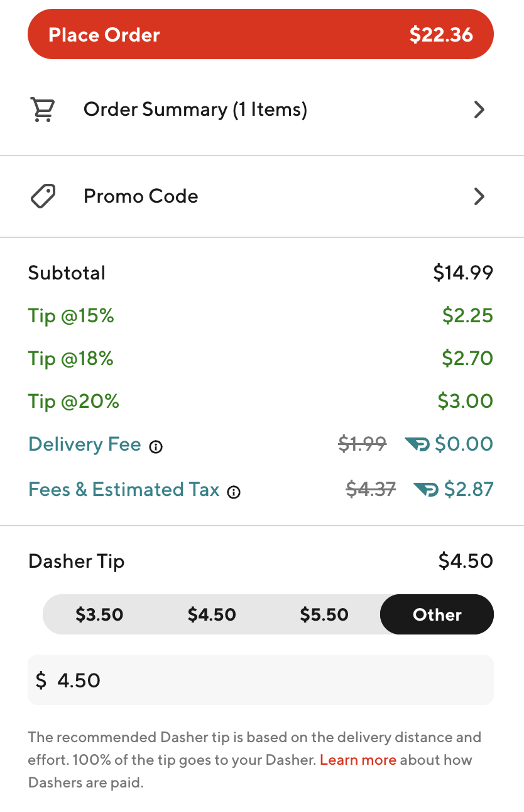

## Doordash Tip
### Check and copy the app version and commit hash quickly

Adds a tip information, ranging from 15%, 18% to 20% on Subtotal amount next to order subtotal for convienience.

### Screenshot


### Installation
- Clone the repository
    ```sh
    $ git clone git@github.com:tHBp/doordash-tip.git
    ```
- Open extensions using `chrome://extensions`
- Enable developer mode
- Click on `Load Unpacked` and select the cloned directory

### Development
```sh
$ npm install
$ npm run dev       # to start dev server
$ npm run build     # to build the extension
```